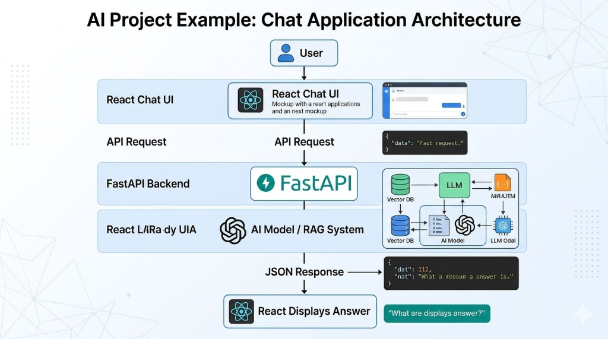

# 🇳🇵 Nepal Constitution Chatbot (नेपालको संविधान च्याटबट)

An intelligent, RAG-powered (Retrieval-Augmented Generation) conversational assistant designed to answer questions about the **Constitution of Nepal (2015)**. Built with a modern **React + Vite** frontend, a fast asynchronous **FastAPI** backend, and a **LangChain + ChromaDB + Google Gemini** AI pipeline.

[](https://www.python.org/)
[](https://fastapi.tiangolo.com/)
[](https://react.dev/)
[](https://vitejs.dev/)
[](https://tailwindcss.com/)
[](https://python.langchain.com/)
[](https://aistudio.google.com/)
[](LICENSE)

---

## 📸 System Architecture

The following diagram illustrates the complete end-to-end data flow and architectural components of the application:

<div align="center">
  
</div>

### Architectural Workflow

1. **User Interaction**: The user enters a question via the interactive React UI.
2. **API Request**: The frontend issues an asynchronous HTTP POST request to the `/chat` endpoint on the FastAPI server.
3. **Hybrid RAG Pipeline**:
   - The query is processed through an **Ensemble Retriever** combining:
     - **BM25 Retriever (30%)**: High-precision keyword matching for specific constitutional articles, legal terms, and clauses.
     - **ChromaDB Vector Store (70%)**: Dense semantic search powered by `sentence-transformers/all-MiniLM-L6-v2` embeddings.
4. **Context Injection & Prompting**: Top relevant document chunks from the Constitution PDF are injected into a specialized prompt instructing the model to answer based strictly on verified constitutional context.
5. **Generative Inference**: **Google Gemini (gemini-2.5-flash)** synthesizes an accurate, fluent, and well-structured response.
6. **JSON Response**: FastAPI returns the generated answer payload to the frontend.
7. **Display**: The React application renders the response with Markdown support, timestamps, and intuitive conversational styling.

---

## ✨ Key Features

- **📖 Grounded in the Official Text**: Indexed directly from the official Constitution of Nepal (2015) PDF document.
- **🔍 Hybrid Retrieval (Dense + Sparse)**: Combines semantic vector similarity search with BM25 keyword matching for maximum recall and precision.
- **🛡️ Anti-Hallucination Guardrails**: Prompt engineering ensures the model answers strictly based on the extracted context and acknowledges when information is unavailable.
- **⚡ Local CPU Embeddings**: Generates embeddings locally using HuggingFace's `sentence-transformers/all-MiniLM-L6-v2`, saving API latency and external costs.
- **💬 Sleek, Responsive Chat Interface**:
  - Built with React 19 & Tailwind CSS.
  - Full Markdown rendering (tables, bold headings, lists) via `react-markdown` and `remark-gfm`.
  - Quick-start suggested question prompts.
  - Auto-scrolling, auto-expanding text input, and message timestamps.
  - Welcome orientation card with constitutional emblems.
- **🚀 High-Performance REST API**: FastAPI backend with CORS configuration, Pydantic validation, and thread-safe pipeline caching.

---

## 🛠️ Tech Stack

| Domain | Technology / Library | Purpose |
| :--- | :--- | :--- |
| **Frontend UI** | React 19, Vite | Responsive Single Page Application (SPA) |
| **Styling** | Tailwind CSS v4 | Modern, utility-first UI styling |
| **Markdown** | `react-markdown`, `remark-gfm` | Rich rendering of bot responses (lists, tables, bold text) |
| **Backend API** | FastAPI, Uvicorn | Asynchronous web server and REST API endpoints |
| **Data Validation** | Pydantic | Request/response schema validation |
| **Orchestration** | LangChain Core / Community / Classic | Document loading, chunking, retrieval & LLM chains |
| **Vector Database**| ChromaDB | Persistent local vector store for semantic embeddings |
| **Keyword Search** | Rank-BM25 | Sparse lexical keyword retrieval |
| **Embeddings** | HuggingFace (`all-MiniLM-L6-v2`) | Local dense semantic sentence embeddings |
| **LLM Model** | Google Gemini (`gemini-2.5-flash`) | Contextual reasoning and answer generation |

---

## 📁 Repository Structure

```text
Constitution_Chatbot/
├── assets/
│   └── architecture.png           # Architecture diagram image
├── backend/
│   ├── chroma_db/                 # Persistent Chroma vector store
│   ├── consituition of nepal.pdf  # Source document (Constitution of Nepal 2015)
│   ├── .env.example               # Environment variables template
│   ├── main.py                    # FastAPI server entrypoint & CORS config
│   ├── rag_engine.py              # LangChain RAG pipeline (BM25 + Chroma + Gemini)
│   ├── requirements.txt           # Python backend dependencies
│   └── .gitignore                 # Backend-specific ignore rules
├── frontend/
│   └── frontend/                  # React + Vite application
│       ├── public/                # Static assets & icons
│       ├── src/
│       │   ├── assets/            # Component images & media
│       │   ├── components/
│       │   │   ├── ChatBox.jsx    # Core chat interface & message state
│       │   │   ├── Header.jsx     # App header and title banner
│       │   │   └── Message.jsx    # Formatted chat bubble with Markdown
│       │   ├── App.jsx            # Main app shell
│       │   ├── main.jsx           # React DOM root entry
│       │   └── index.css          # Tailwind CSS definitions
│       ├── package.json           # Frontend dependencies & scripts
│       └── vite.config.js         # Vite configuration
├── .gitignore                     # Repository root gitignore
└── README.md                      # Project documentation
```

---

## 🚀 Getting Started

Follow these steps to set up and run the project locally on your machine.

### Prerequisites

Ensure you have the following installed:
- [Python 3.10+](https://www.python.org/downloads/)
- [Node.js (v18+) & npm](https://nodejs.org/)
- [Google AI Studio API Key](https://aistudio.google.com/) for Google Gemini

---

### 1. Clone the Repository

```bash
git clone https://github.com/namratashahi18/Constitution_Chatbot.git
cd Constitution_Chatbot
```

---

### 2. Backend Setup

1. **Navigate to the backend directory**:
   ```bash
   cd backend
   ```

2. **Create a virtual environment**:
   ```bash
   # On Windows
   python -m venv myenv
   myenv\Scripts\activate

   # On macOS/Linux
   python3 -m venv myenv
   source myenv/bin/activate
   ```

3. **Install Python dependencies**:
   ```bash
   pip install -r requirements.txt
   ```

4. **Configure your environment variables**:
   Create a `.env` file inside the `backend/` directory (or copy from `.env.example`):
   ```bash
   # Windows (PowerShell)
   Copy-Item .env.example .env

   # Linux/macOS
   cp .env.example .env
   ```

   Open `.env` and add your Google Gemini API key:
   ```env
   GOOGLE_API_KEY=your_actual_gemini_api_key_here
   ```

5. **Start the FastAPI backend server**:
   ```bash
   uvicorn main:app --reload --port 8000
   ```
   The backend will be live at `http://localhost:8000`. You can inspect interactive API documentation at `http://localhost:8000/docs`.

---

### 3. Frontend Setup

1. **Open a new terminal and navigate to the frontend directory**:
   ```bash
   cd frontend/frontend
   ```

2. **Install Node dependencies**:
   ```bash
   npm install
   ```

3. **Run the development server**:
   ```bash
   npm run dev
   ```

4. **Access the Chatbot**:
   Open your browser and navigate to:
   ```text
   http://localhost:5173
   ```

---

## 🔌 API Endpoints

### Health Check
- **Endpoint**: `GET /`
- **Description**: Verifies if the backend service is operational.
- **Response**:
  ```json
  {
    "status": "ok",
    "service": "Nepal Constitution Chatbot API"
  }
  ```

### Chat Query
- **Endpoint**: `POST /chat`
- **Headers**: `Content-Type: application/json`
- **Request Body**:
  ```json
  {
    "message": "What does Article 1 of the Constitution state?"
  }
  ```
- **Response Body**:
  ```json
  {
    "answer": "Article 1 of the Constitution of Nepal declares the Constitution to be the fundamental law of the nation..."
  }
  ```

---

## 💡 Example Questions to Try

- *"What is Article 1 of the Constitution?"*
- *"How many articles, parts, and schedules are in the Constitution of Nepal?"*
- *"What fundamental rights are guaranteed to women in Article 38?"*
- *"What is the structure of the federal legislature in Nepal?"*
- *"Explain the procedure for constitutional amendments under Part 31."*
- *"How many provinces are established, and how are their boundaries determined?"*

---

## 🗺️ Roadmap & Enhancements

- [ ] **Bilingual Support**: Add native Nepali language (Devanagari script) query understanding and response generation.
- [ ] **Direct Article Citations**: Provide clickable page number and article references next to each generated answer.
- [ ] **Multi-Turn Conversation Memory**: Maintain chat history across multiple questions in a session.
- [ ] **Export & Share**: Allow users to download chat transcripts as PDF/Markdown.

---

## 📄 License

This project is licensed under the [MIT License](LICENSE) - feel free to use, modify, and distribute with attribution.

---

## 👤 Author

Developed by **[Namrata Shahi](https://github.com/namratashahi18)**.

*If you found this project helpful, please consider giving it a ⭐ on [GitHub](https://github.com/namratashahi18/Constitution_Chatbot)!*